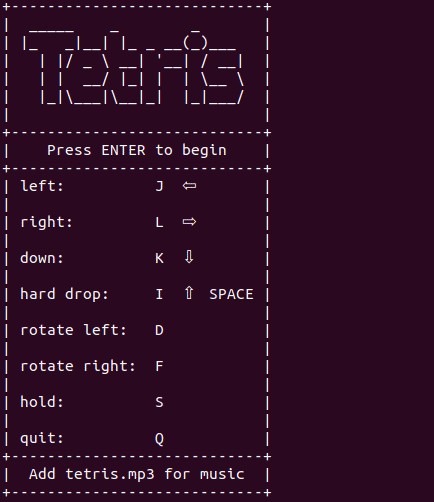
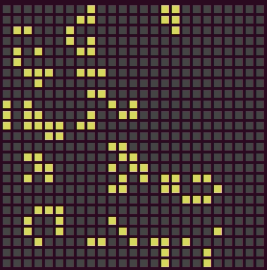

### 2d games in the terminal using strings

*a fun project for learning rust*

## Tetris
`cargo run --example tetris`

### Retrospective:
* using traits for complex behvior extension ("inheritance") lead to issues seperating `examples/tetris.rs` into modules
  * did not maintain a clear seperation of the structs' roles
  * in future: break into modules early and often
* better function wrapping pattern?
* control loops are fun
* manual testing is fun (get to play tetris)
* `crate prettytable` worked wonderfully with string based display
  * made adding features a breeze

## Conway's Game of Life
`cargo run --example game_of_life`

### Retrospective:
* `Tile` struct unnecessary (just use a bool)
  * `impl Depict` is overkill, but a nice example of traits
* simple extension of struct behavior with `trait Update` worked well
